# IP-Addr-Counter

> **TL;DR:** If you just want to see the final solution, go to
> [cmd/ip-store-v2/main.go](cmd/ip-store-v2/main.go). Below you'll find a screenshot to prove
> that this solution worked and was able to find the 1 billion unique IPv4 addresses
> from `ip_addresses`.
> The rest of this README explains how I arrived at that solution and what decisions/
> optimizations I made along the way.

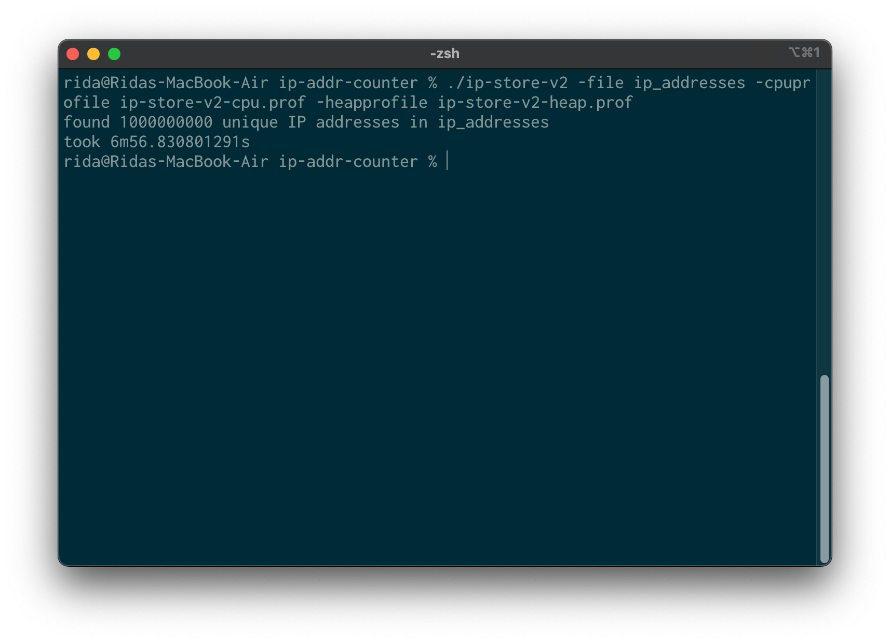

## Table of contents

1. [Assumptions](#assumptions)
1. [Test data](#test-data)
1. [Performance disclaimer](#performance-disclaimer)
1. [Solution 1: naive](#solution-1-naive)
1. [Solution 2: sorted-slice](#solution-2-sorted-slice)
1. [Solution 3: sorted-slice-dedup](#solution-3-sorted-slice-dedup)
1. [Solution 4: ip-store](#solution-4-ip-store)
1. [Solution 5: ip-store-v2](#solution-5-ip-store-v2)
1. [Failed solution: ip-store-concurrent](#failed-solution-ip-store-concurrent)

## Assumptions

For a problem like this one, it makes sense to discuss the constraints/assumptions first. Here
are the assumptions I made about the input file:

1. There are never more than 2^63-1 lines in an input file (the number of lines can be represented with an `int64`)
1. The input file only contains ASCII characters
1. A line in the input file ends with a UNIX-style newline character ("\n", not Windows-style "\r\n")
1. A line in the input file either contains a valid IPv4 address or nothing at all
1. If a line is empty, it should be ignored

## Test data

First, I needed some way to generate test files that are smaller than the one provided.
To do that, I wrote a small Python script that creates test files with random IPv4 addresses.
I also wrote a tiny shell script that counts the number of unique IP addresses in those
test files.

[generate.py](test/gen/generate.py)

[count.sh](test/gen/count.sh)

I also pre-generated and included a couple of small test files for unit tests.

[test/static](test/static)

Throughout the solutions, I used a file called `test/gen/large.txt` created with `generate.py`.
This file is about 1GB in size and contains **66587150** unique IPv4 addresses. I did not include
it in this repository to make it easier to clone.

## Performance disclaimer

I rely on profilers a lot in my daily work. However, performance is a very tricky
subject, and it varies a lot depending on the environment where our programs run. All the
profiling data provided in this README was recorded on an M2 MacBook with 8GB RAM.
I also used `go1.22.4 darwin/arm64`.

## Solution 1: [naive](cmd/naive/main.go)

First, I implemented the naive algorithm. I planned on profiling this solution
to figure out what needs to be optimized.

The algorithm itself is quite unremarkable. It takes every non-empty line of
the input file and puts it into a `map[string]struct{}`. When all lines are
read, it returns the `len()` of the map, thus counting all unique IPs in the
input file.

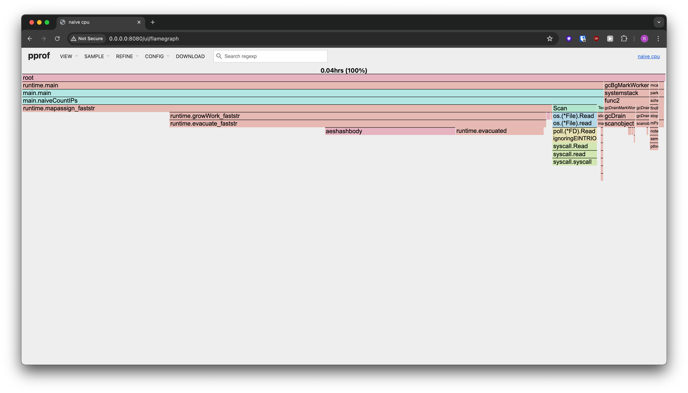

After looking at the CPU profile for this solution, it was clear that the
algorithm spends most of its time putting strings into the `map`. Thus, I needed
some way to use the map more creatively or avoid using it altogether.

## Solution 2: [sorted-slice](cmd/sorted-slice/main.go)

An IPv4 is essentially a `uint32`. I leveraged this fact to design my next solution.
The "sorted-slice" algorithm takes every IPv4 from the input file, converts it to a
`uint32`, and stores that in a slice. When the whole file has been read, it sorts the
slice and counts unique elements by linear traversal.

In theory, the sorted-slice algorithm should be slower than naive. Big O of this
algorithm is O(n log n), which is slower than O(n) of the naive algorithm. However,
the real world is a bit more complicated than theory, so the sorted-slice algorithm
finished counting `test/gen/large.txt` in ~9 seconds, while the naive algorithm took
~1m30s. Not bad!

> I'm not sure what algorithm [Go's `slices.Sort()`](https://pkg.go.dev/slices#Sort) function
> uses internally, but [Wikipedia](https://en.wikipedia.org/wiki/Sorting_algorithm) claims that
> the fastest sorting algorithms currently known run in O(n log n).

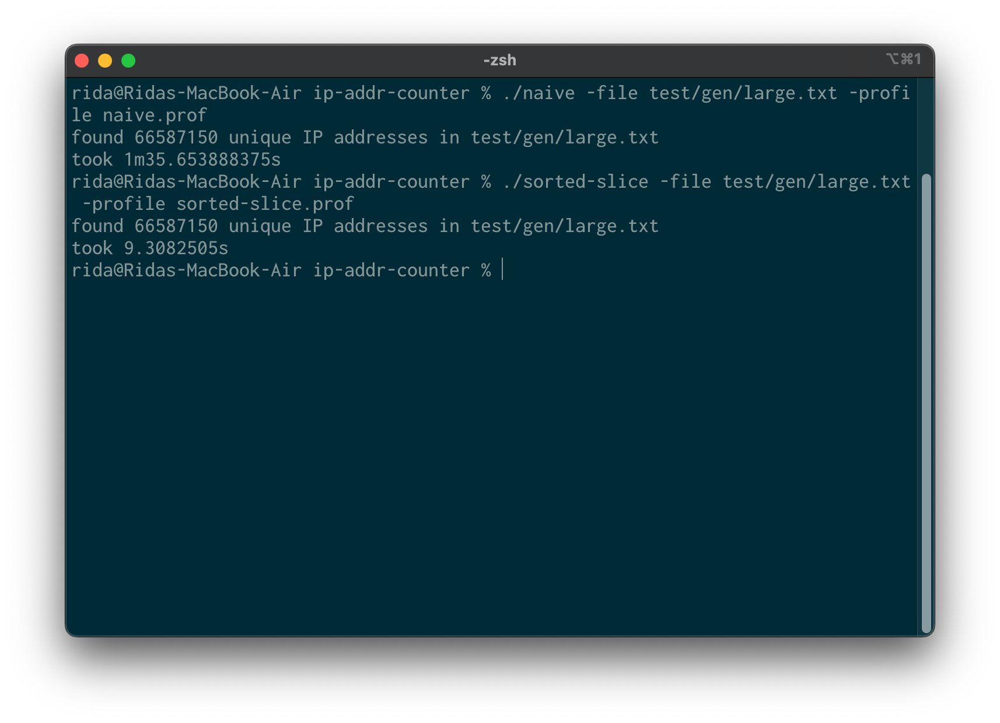

CPU profile shows that sorted-slice spends most of its time reading the input file and
sorting the array of IP addresses before counting unique instances.

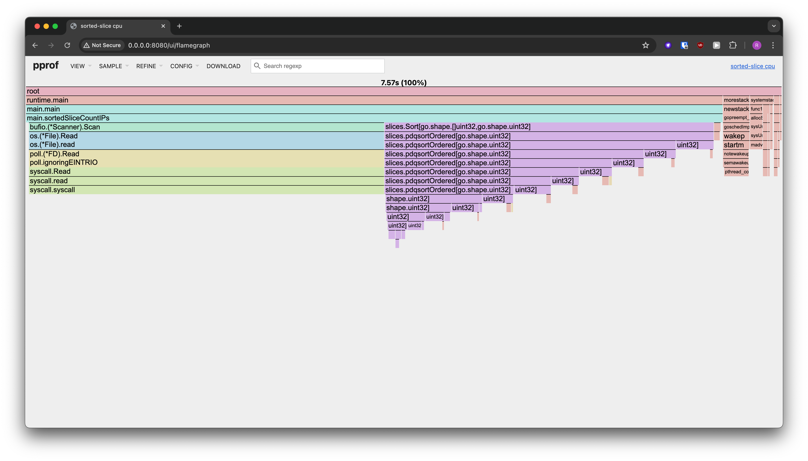

## Solution 3: [sorted-slice-dedup](cmd/sorted-slice-dedup/main.go)

Until now, I've focused on speed and ignored memory consumption. The naive algorithm
stores every unique IP address as a string (max 15 bytes per IPv4). This is before
we add any of the overhead a `map` adds internally and account for the buffer that
`bufio.Scanner()` uses internally.

Sorted-slice is more lightweight because it only uses 4 bytes per IP address
and uses a data structure with much smaller overhead for storing IPs. However, since IP
addresses are stored until the very end, memory usage grows uncontrollably,
which may cause an OOM issue.

The "sorted-slice-dedup" algorithm works around this problem by periodically triggering
a deduplication (dedup for short) of the collected IP addresses. This way we can control
memory consumption. The deduplication threshold I used is an arbitrary power of 2, but
I exposed it as a parameter so it can be tweaked if necessary.

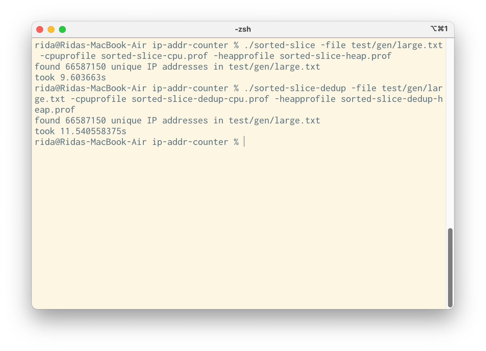

Unsurprisingly, sorted-slice-dedup is slower than sorted-slice. It was now spending more time
sorting the IP slice during deduplication. However, it's a worthy tradeoff if we're planning
on processing really large files.

## Solution 4: [ip-store](cmd/ip-store/main.go)

I tried running "sorted-slice-dedup" on the provided `ip_addresses` file. However, I quickly
noticed that the amount of consumed RAM was ballooning out of control, so I killed the process
after a couple of minutes. I then re-ran it on `test/gen/large.txt` and turned on
heap profiling to try to understand what was going on.

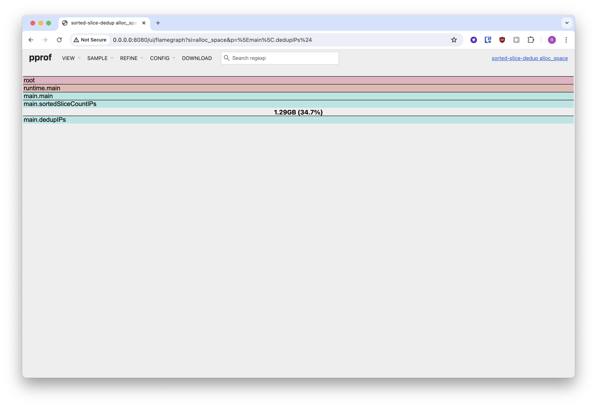

`dedupIPs()` was allocating a lot of memory when doing
`append()`s, since that operation can trigger a reallocation of the slice. A slice reallocation
means that in theory, we can be consuming up to 3 times the `cap()` of a slice.

I needed another solution, so I decided to design a custom data structure to store IPs.
I called it `IPStore`, and it's a simplified hashmap that uses the first 3 bytes of
an IP address as hash. This way, buckets take up a constant amount of space, and insertions
make at worst 256 comparisons (the low byte of an IP). I also got rid of any hashmap features that
I don't need to simplify the code and provide faster lookups (notably, `IPStore`
allocates the buckets slice upfront and never rebalances it).

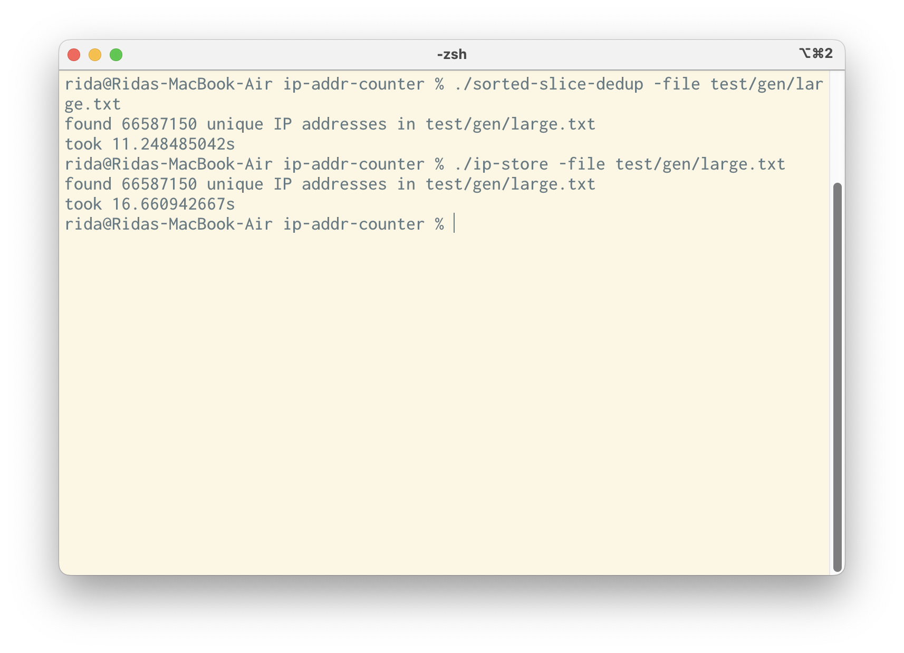

"ip-store" is slower than "sorted-slice-dedup", but it provides reasonable performance
for the task at hand. I ran it on the `ip_addresses` file and was finally able to get the result.

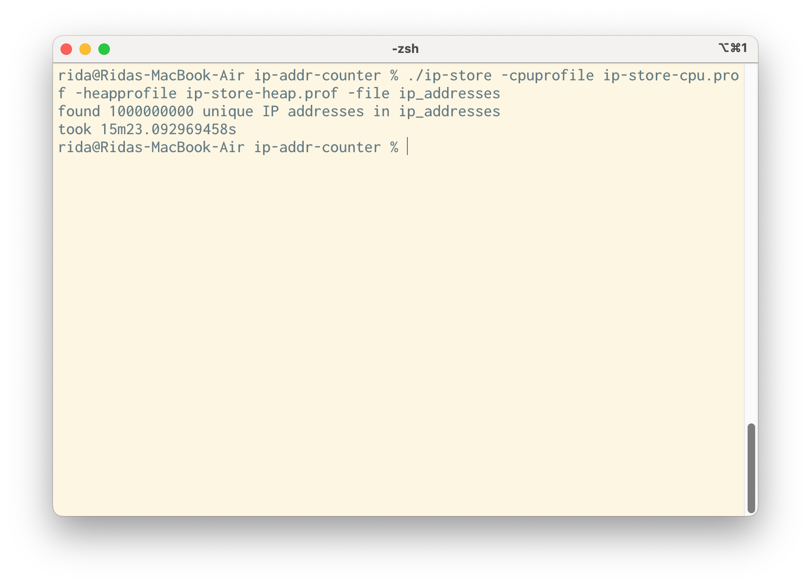

The CPU profile shows that most of the time was spent in `IPStore.Insert()`. A considerable amount was
spent reading the file, but this is somewhat expected. Memory usage stayed consistent at around 
~7GB during the run. Heap profile says that some of this memory was allocated in `NewIPStore()` during
bucket allocation, but most of it was allocated in `IPStore.Insert()`.

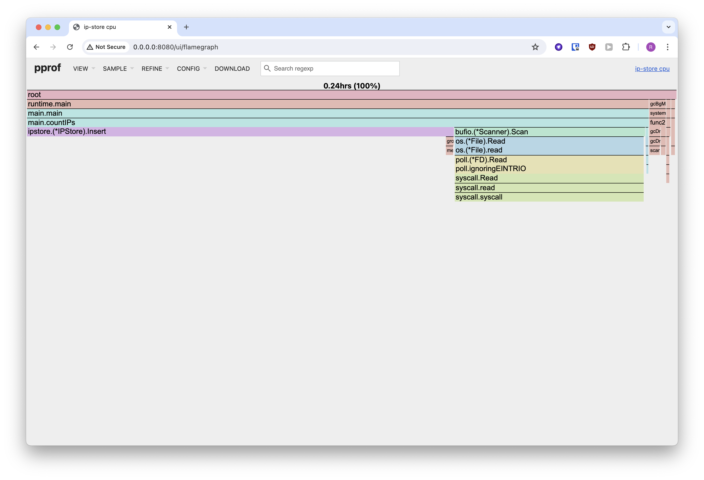

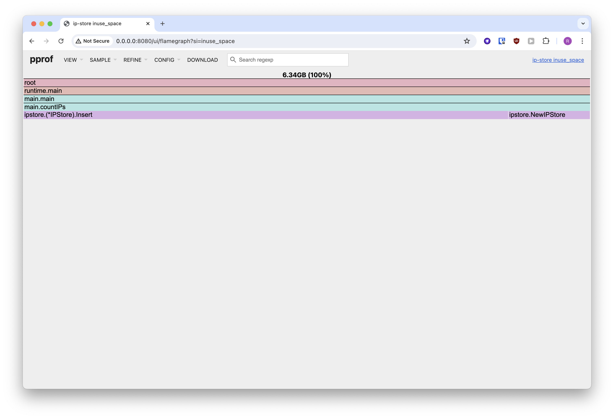

## Solution 5: [ip-store-v2](cmd/ip-store-v2)

I was quite content with the `IPStore` data structure, but I was still unhappy about having to allocate a slice for
each of the `IPStore` buckets. I decided to try avoiding heap allocations by using a bitmap. Since there can be at most
256 IPs in every `IPStore` bucket, they can all be represented with a 256-bit bitmap (4 `uint64`s). I changed
the implementation of `IPStore`, but left the driver code unchanged. The results were quite impressive -- 
CPU time was cut more than twice (~15m vs ~6m), and memory usage went down almost 5 times (~7GB vs ~1.5GB).
CPU profile shows that now almost all of the time was spent reading the file from disk. Heap profile revealed that
almost all memory was allocated during `IPStore` creation, and there were almost no heap allocations after that
was done. 

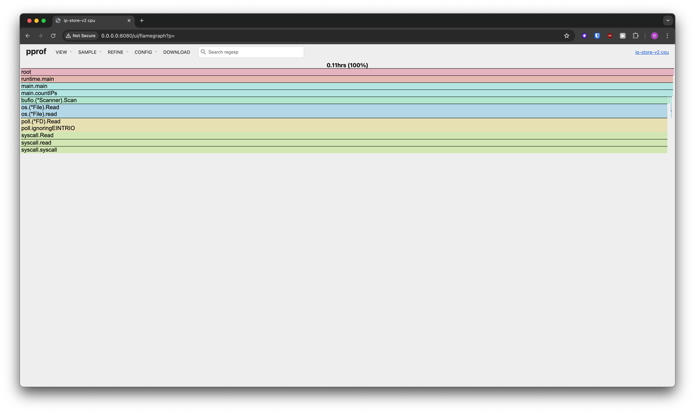

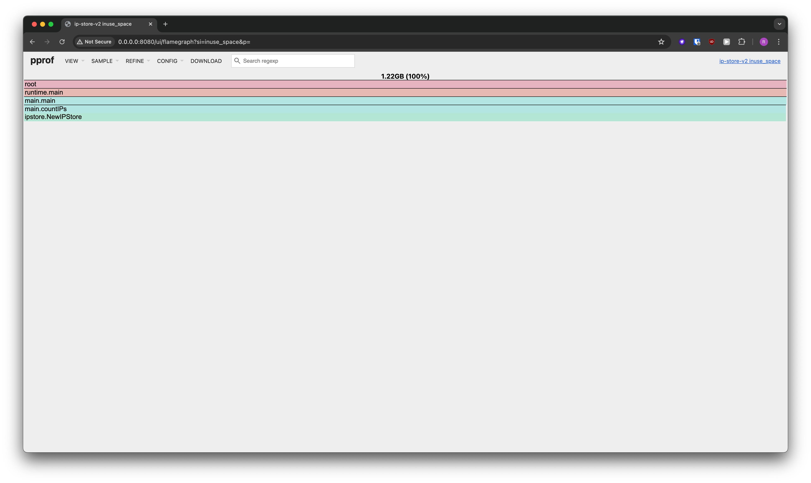

## Failed solution: [ip-store-concurrent](cmd/ip-store-concurrent/main.go)

This solution failed, but I decided to include it for three reasons:
1. It's still a working solution
1. It demonstrates my ability to use Go's concurrent features
1. Sometimes we all make mistakes. It's important to reflect on why those mistakes were made
 to avoid repeating them in the future

I decided to try processing the file in parallel chunks to see if that speeds up ip-store.
Unfortunately, the code turned out to be really complicated and added a lot of overhead. This can
be seen clearly in the CPU profile. Most of the time was now spent synchronizing channels and waiting
until the IPs could be inserted in `IPStore`.

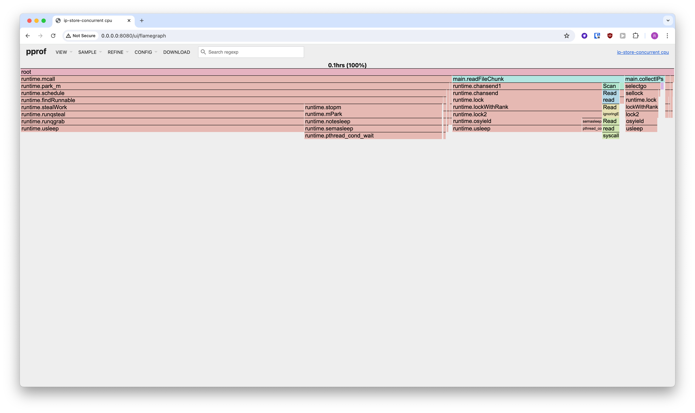
